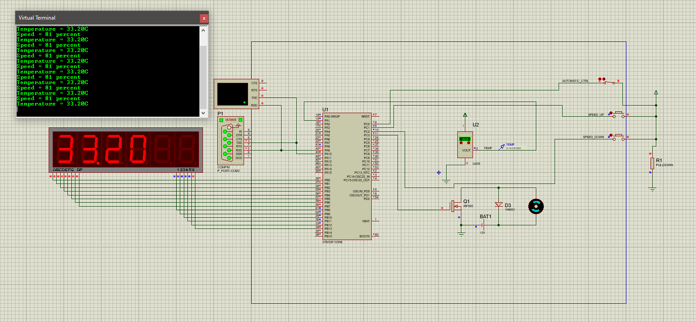

# [ENG] Supervisory System Based on STM32F103 Microcontroller for Temperature Monitoring and Cooling Fan Speed Control

## Project Description

The project uses an integrated temperature sensor LM35, which provides an analog voltage proportional to the temperature at its output. The sensor's output voltage dictates the speed of the cooling fan motor. The microcontroller's A/D converter is used to measure the analog voltage of the temperature sensor. The A/D converter measurement is triggered with a timer trigger signal every 2 seconds.

The control of the cooling fan motor speed is achieved through the PWM mode of the microcontroller's timer. The motor speed, or duty cycle parameter, can be regulated in two ways:

- Automatic mode
- Manual mode

In automatic mode, based on the sensor's temperature, the fan speed increases or decreases proportionally. The pulse width, ranging from 0 to 100% of the entire pulse period, changes accordingly. In manual mode, by pressing one of two buttons, SPEED_UP or SPEED_DOWN, the fan speed is increased or decreased. The mode selection is determined by the AUTOMATIC_CTRL switch.

During operation, information about the temperature and fan speed is displayed on a 6-digit 7-segment display. The temperature is displayed every 5 seconds in a format with two decimal points, followed by the fan speed in percentage from 0 to 100%.

Additionally, every 10 seconds, data is sent via serial communication through the USART controller with a message containing both the temperature and fan speed as a string. The data transmission via USART is implemented using interrupts. The serial communication parameters are set to 9600-N-1. Messages are received through a virtual terminal in the schema.

An application on the computer is created that receives data from the microcontroller, i.e., the given simulator, through serial communication. For communication between the application and Proteus 8 simulation, software (Virtual Serial Port Driver) is used to create a virtual connection between two COM ports. COM1 and COM3 ports are connected by crossing Rx and Tx pins, while GND is connected in a 1-1 connection.

## Project Schematic and Operation Display

Project Schematic.

Operation display and temperature value output on the 7-segment display and in the terminal.

Operation display and fan motor speed value output in percentages on the 7-segment display and in the terminal.

## Application

## Tools and Programming Languages Used

- Project schematic and simulation were realized using Proteus 8 software.
- Code for the microcontroller was written and compiled in the Eclipse IDE using the C programming language.
- The application for reading serial communication from the microcontroller was implemented using the Python programming language.

---

# [СРП] Надзорни систем на бази STM32F103 микроконтролера за праћење температуре и контролу обртаја мотора расхладног вентилатора

## Опис пројекта

У пројекту се користити интегрисани температурни сензор LM35 који на свом излазу 2 даје аналогни напон сразмеран температури која се може задати ручно. 
Вредност сензора диктира брзину окретања мотора вентилатора.
За мерење аналогног напона температурног сензора се користити А/Д конвертор микроконтролера. 
Мерење А/Д конвертора се окида са тајмерским тригер сигналом на сваке 2 секунде.
Контрола брзине окретања мотора вентилатора се остварује преко PWM режима рада тајмера микроконтролера. Брзину окретања мотора односно duty cycle параметар је могуће регулисати на два начина: 

- аутоматском режиму рада
- ручном режиму рада 

У аутоматском режиму рада, на основу температуре сензора, сразмерно се повећава или смањује брзина окретања вентилатора, односно ширина импулса, која се мења од 0 до 100% целе периоде импулса. 
У ручном режиму рада, притиском на један од два тастера, SPEED_UP или SPEED_DOWN, брзина вентилатора се смањује или повећава. 
Избор режима рада се одређује са прекидачем AUTOMATIC_CTRL.
Током рада, информације о температури и брзини окретања вентилатора се приказују на седмо-сегментном дисплеју од 6 цифара, тако што се на сваких 5 секунди приказује температура у формату са две децималне тачке, а након тога брзина окретања вентилатора у проценту од 0 до 100%. 

Такође, на сваких 10 секунди се подаци шаљу серијском комуникацијом преко USART контролера са поруком која садржи и температуру и брзину окретања вентилатора у виду стринга. 
Слање података преко USART-а реализовано је коришћењем прекида. 
Параметри серијске комуникације су 9600-N-1. Поруке се примају преко виртуелног терминала на шеми.

Такође је и креирана апликација на рачунару која серијском комуникацијом добија податке од микроконтролера, тј. датог симулатора. 
За реализацију комуникације између апликације и Proteus 8 симулације коришћен је софтвер (Virtual Serial Port Driver) за креирање виртуелне везе између два COM порта. Повезани су портови COM1 и COM3 тако што су им укрштени пинови Rx i Tx, док је GND повезан 1-1 везом.

## Шематик пројекта и приказ рада 

Шематик пројекта.

Приказ рада и испис вредности температуре на седмо-сегментном дисплеју и у терминалу.

Приказ рада и испис вредности брзине окретања мотора у процентима на седмо-сегментном дисплеју и у терминалу.

## Апликација

## Коришћени алати и програмски језици

- Шематик и симулација пројекта реализовани су помоћу софтвера Proteus 8.
- Код за микроконтролер је написан и компајлиран у софтверу Eclipse IDE помоћу програмског језика C.
- Апликација за читање серијске комуникације микроконтролера реализована је помоћу програмског језика Python.

