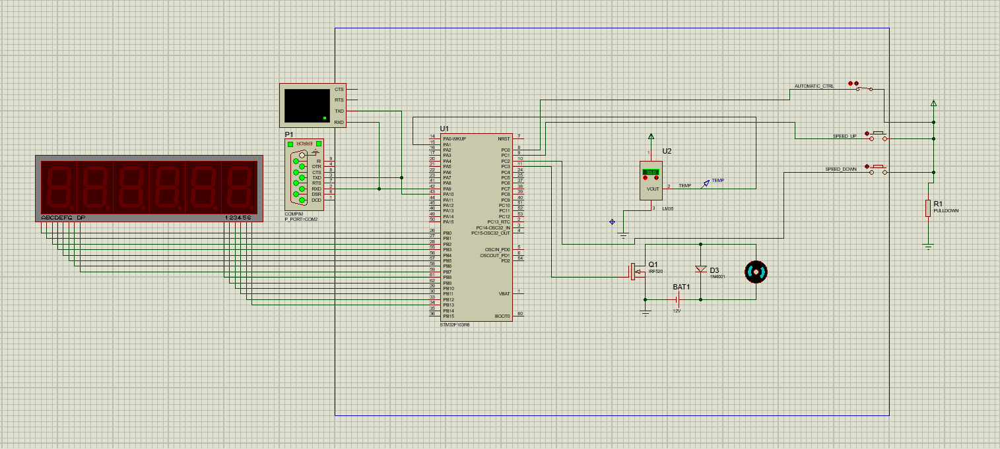

# Надзорни систем на бази STM32F103 микроконтролера за праћење температуре и контролу обртаја мотора расхладног вентилатора

## Опис пројекта

У пројекту се користити интегрисани температурни сензор LM35 који на свом излазу 2 даје аналогни напон сразмеран температури која се може задати ручно. 
Вредност сензора диктира брзину окретања мотора вентилатора.
За мерење аналогног напона температурног сензора се користити А/Д конвертор микроконтролера. Мерење А/Д конвертора се окидати са тајмерским тригер сигналом на сваке 2 секунде.
Контрола брзине окретања мотора вентилатора се остварује преко PWM режима рада тајмера микроконтролера. Брзину окретања мотора односно duty cycle параметар је могуће регулисати на два начина: 

- аутоматском режиму рада
- ручном режиму рада 

У аутоматском режиму рада, на основу температуре сензора, сразмерно се повећава или смањује брзина окретања вентилатора, односно ширина импулса, која се мења од 0 до 100% целе периоде импулса. 
У ручном режиму рада, притиском на један од два тастера, SPEED_UP или SPEED_DOWN, брзина вентилатора се смањује или повећава. 
Избор режима рада се одређује са прекидачем AUTOMATIC_CTRL.
Током рада, информације о температури и брзини окретања вентилатора се приказују на седмо-сегментном дисплеју од 6 цифара, тако што се на сваких 5 секунди приказује температура у формату са две децималне тачке, а након тога брзина окретања вентилатора у проценту од 0 до 100%. 

Такође, на сваких 10 секунди се подаци шаљу серијском комуникацијом преко USART контролера са поруком која садржи и температуру и брзину окретања вентилатора у виду стринга. 
Слање података преко USART-а реализовано је коришћењем прекида. 
Параметри серијске комуникације су 9600-N-1. Поруке се примају преко виртуелног терминала на шеми.

Такође је и креирана апликација на рачунару која серијском комуникацијом добија податке од микроконтролера, тј. датог симулатора. 
За реализацију комуникације између апликације и Proteus 8 симулације коришћен је софтвер (Virtual Serial Port Driver) за креирање виртуелне везе између два COM порта. Повезани су портови COM1 и COM3 тако што су им укрштени пинови Rx i Tx, док је GND повезан 1-1 везом.

## Шема пројекта

Шематик пројекта.

Приказ рада и испис вредности температуре на седмо-сегментном дисплеју и у терминалу.

Приказ рада и испис вредности брзине окретања мотора у процентима на седмо-сегментном дисплеју и у терминалу.

## Апликација

## Коришћени алати и програмски језици

- Шематик и симулација пројекта реализовани су помоћу софтвера Proteus 8.
- Код за микроконтролер је написан и компајлиран у софтверу Eclipse IDE помоћу програмског језика C.
- Апликација за читање серијске комуникације микроконтролера реализована је помоћу програмског језика Python.

